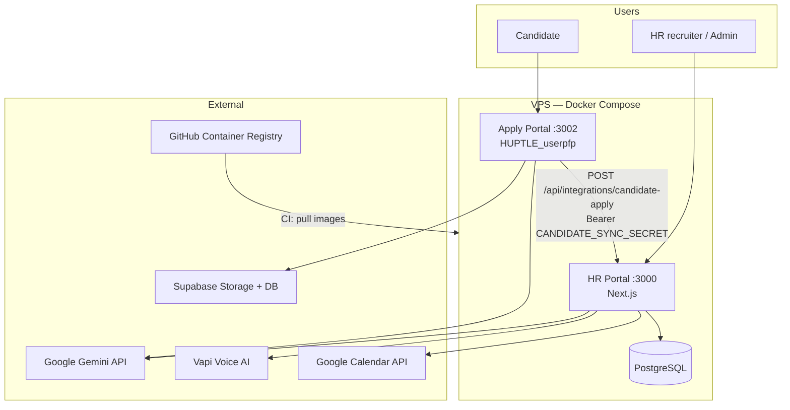
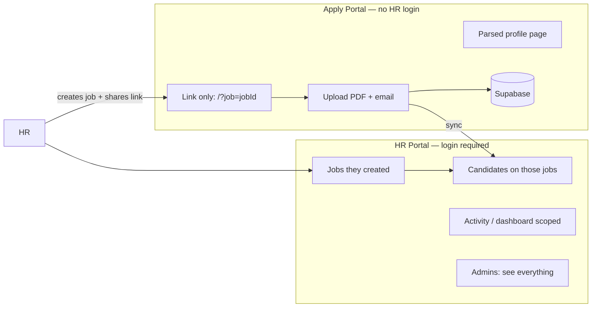
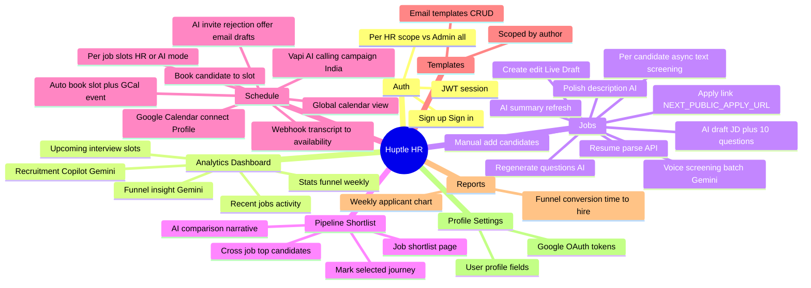
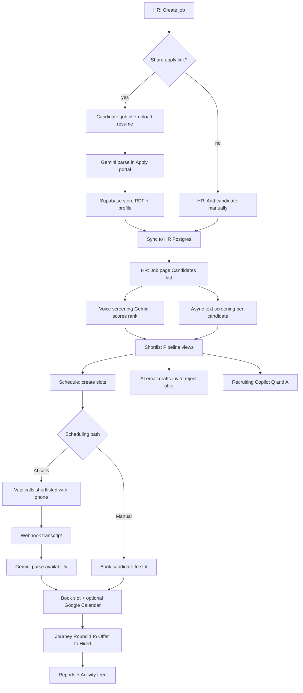
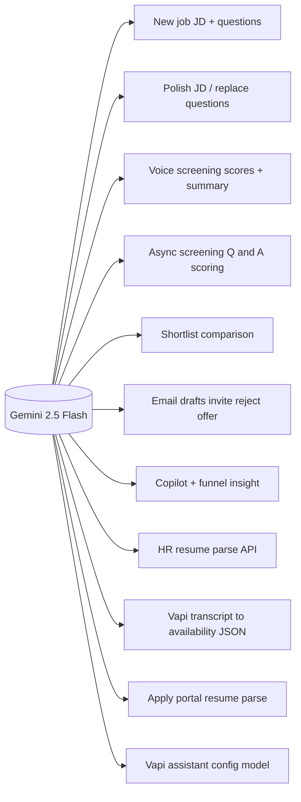
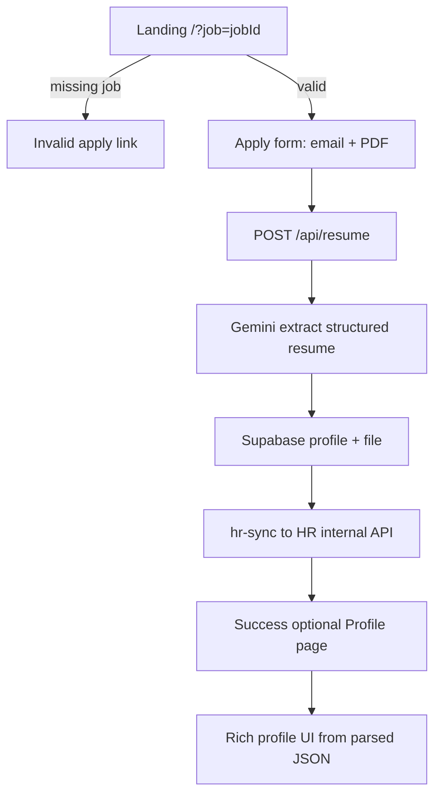
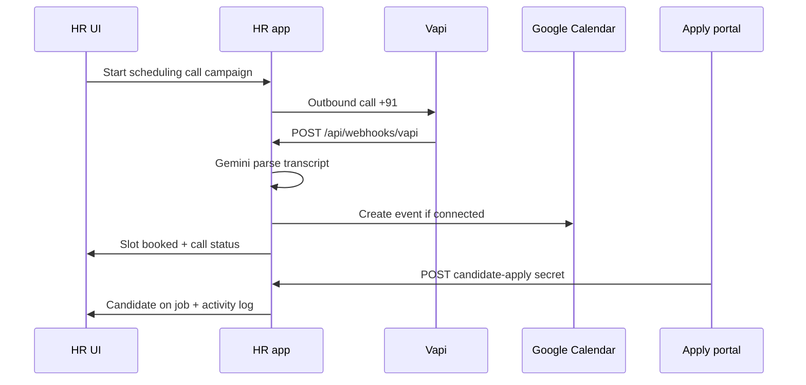
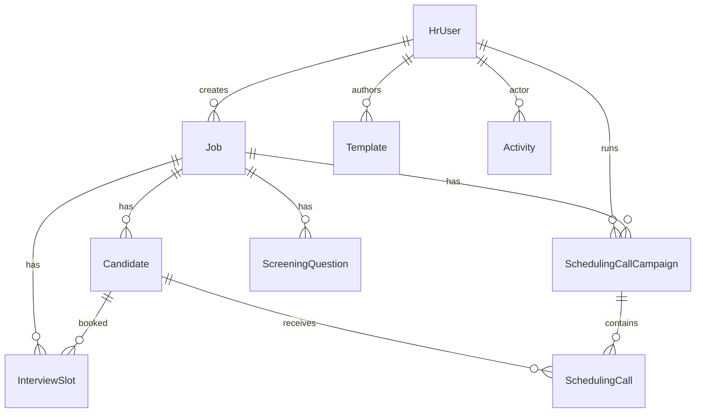
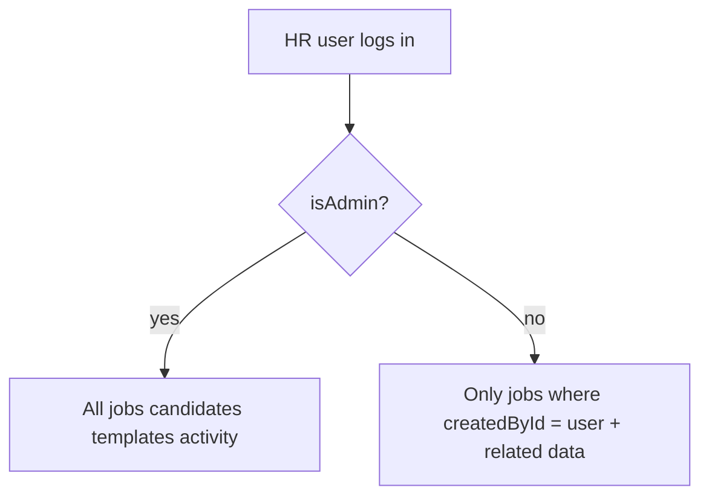
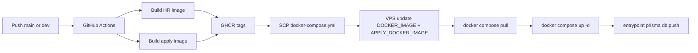

# Huptle HR + Candidate Apply — Application Guide

**Version:** As of May 2026  
**Stack:** Next.js HR portal, Next.js apply portal, PostgreSQL, Docker on VPS, GitHub Actions → GHCR

---

## 1. System overview

| Layer | Role |
|--------|------|
| **HR portal** (`app`) | Jobs, candidates, screening, scheduling, reports, templates |
| **Apply portal** (`apply`) | Resume upload, parse, Supabase profile; syncs to HR |
| **Postgres** | Single source of truth for HR data |
| **CI/CD** | Build both images → GHCR → VPS `docker compose pull` |

---

## 2. Who sees what

**Notes:**

- Candidates do **not** browse all HR jobs — they need a job-specific link (`?job=…`).
- HR does **not** use Supabase directly — apply portal syncs parsed data into Postgres.

---

## 3. HR portal — features by menu

---

## 4. End-to-end hiring pipeline

**Candidate journey states** (`Candidate.journey`):

`Applied` → `Shortlisted` → `Round 1` / `Round 2` / `Round 3` → `Offer Sent` → `Offer Accepted`

---

## 5. AI (Gemini) touchpoints

Without `GEMINI_API_KEY`, voice screening uses **simulated random scores** so the UI remains usable.

---

## 6. Apply portal (candidate) flows

**Pages:** apply home (`/?job=`), parsed profile (`/profile`). OTP APIs exist (`/api/otp/send`, `/api/otp/verify`).

---

## 7. Integrations and webhooks

| Integration | Check | Configuration |
|-------------|--------|----------------|
| Gemini | `GET /api/integrations/status` | `GEMINI_API_KEY`, `GEMINI_MODEL` |
| Vapi | same | `VAPI_*`, public HTTPS webhook URL |
| Google Calendar | same | OAuth; requires HTTPS domain |
| Email send | `not_configured` | Drafts only — no SMTP wired |
| Candidate sync | env on both services | `CANDIDATE_SYNC_SECRET`, `HR_PORTAL_INTERNAL_URL` |

---

## 8. Data model (core entities)

**Candidate uniqueness:** `@@unique([jobId, email])` — re-apply with same email updates the row.

---

## 9. Access control

---

## 10. Deploy flow (production)

**Typical ports:** HR `3000`, Apply `3002`, dev HR `3001`.

---

## 11. URL reference

| App | Path | Purpose |
|-----|------|---------|
| HR | `/` | Dashboard + copilot |
| HR | `/jobs`, `/jobs/[id]` | Jobs, candidates, apply link |
| HR | `/jobs/[id]/shortlist` | Job shortlist |
| HR | `/jobs/[id]/schedule` | Slots + Vapi panel |
| HR | `/jobs/[id]/async-screen/[candidateId]` | Text screening |
| HR | `/shortlist` | Global pipeline |
| HR | `/schedule` | Global calendar |
| HR | `/templates` | Email templates |
| HR | `/reports` | Analytics |
| HR | `/profile` | Settings + Google connect |
| HR | `/signin`, `/signup` | Auth |
| Apply | `/?job=` | Apply form |
| Apply | `/profile` | Parsed resume view |

---

## 12. Environment variables (summary)

### HR portal (`app`)

- `DATABASE_URL`, `AUTH_SECRET`
- `GEMINI_API_KEY`, `GEMINI_MODEL` (e.g. `gemini-2.5-flash`)
- `CANDIDATE_SYNC_SECRET`, `NEXT_PUBLIC_APPLY_URL`
- `VAPI_*` (API key, assistant, phone, webhook secret)
- `GOOGLE_CLIENT_ID`, `GOOGLE_CLIENT_SECRET`, `NEXT_PUBLIC_APP_URL`
- `DOCKER_IMAGE` (set by CI on VPS)

### Apply portal (`apply`)

- `GEMINI_API_KEY`, Supabase URL + anon key
- `CANDIDATE_SYNC_SECRET`
- `HR_PORTAL_INTERNAL_URL=http://app:3000` (Docker)
- `APPLY_DOCKER_IMAGE` (set by CI on VPS)

---

## 13. Candidate apply sequence (detailed)

1. HR creates job (Live or Draft).
2. HR copies apply link: `{NEXT_PUBLIC_APPLY_URL}/?job={jobId}`.
3. Candidate uploads PDF; Gemini parses skills, experience, contact info.
4. File stored in Supabase; profile row created.
5. Apply service POSTs to `http://app:3000/api/integrations/candidate-apply` with Bearer secret.
6. HR upserts `Candidate` on that `jobId`; activity logged for job owner.
7. HR runs voice or async screening, shortlists, schedules (manual or Vapi + Calendar).

---

*Generated from the Huptle HR-tech repository. Re-export this PDF after major feature changes.*
